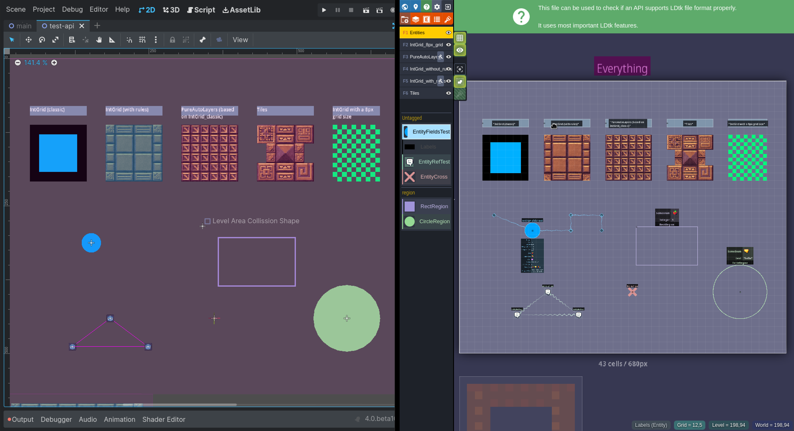

<p align="center">
	
	
</p>

---


[LDtk](https://ldtk.io/) importer for [Godot 4](https://godotengine.org/)

> ⚠ **We are currently working on [a game for PlayDate](https://amano.games/devlog/lets-finish-this) and our project that uses LDtk with Godot is currently on Godot 3.x. So when we resume work on that project and if Godot 4 is ready for us to port the game we will continue to work on this plugin, meanwhile I hope it helps someone to build upon.**

# Installation

1. [Download](https://github.com/afk-mario/amano-ldtk-importer/archive/refs/heads/main.zip)
2. Unpack the `amano-ldtk-importer` folder into your `/addons` folder within the Godot project
3. Enable this addon within the Godot settings: `Project > Project Settings > Plugins`

# Features



- [x] Import LDtk Tilesets as Godot Tilesets
	- [x] Generate Godot TileSetAtlasSources from LDtk Tilesets
	- [x] Import custom data from LDtk in to Tilesets custom data layers
- [x] Import LDtk levels in to Godot
	- [x] Generate Godot Tilemaps from LDtk layers of the following types:
		- Tiles
		- IntGrid
		- AutoLayer
	- [x] Support Godot tilemap layers
	- [x] Support LDtk layers of different grid sizes
	- [ ] Add z-index to Godot layers based on LDtk layer order
- [x] Post import hand modifications using scripts for:
	- Tilesets
	- Levels
	- World
- [x] Import level background images
- [x] Import int layers without tile atlases
- [x] Support level positioning on "GridVania", "Free", "LinearHorizontal" and "LinearVertical" layouts
- [x] Import LDtk Entities
- [ ] Import CSV from simple LDtk export

# Limitations

- [Godot4 doesn't support flipped tiles](https://github.com/godotengine/godot-proposals/issues/3967)
- [Can't support LDtk external level files with the current LDtk implementation](https://github.com/deepnight/ldtk/issues/734)
- LDtk support for multiple tiles in a single layer using auto tile rules, this plugin will not support that.

# Metadata

Metada information will be set on the World root node, the level root node, the tileset resource and the entities root node, from the import options you can choose to skip all the raw metadata and source file entries. This information can be used in the post-script scripts or at runtime.

## World Metadata

In the world root node two metadata keys are added:

- `LDtk_raw_data` The full LDTK parsed JSON as a dictionary
- `LDtk_source_file` the imported LDtk file path

## Tilesets Metadata

In the tileset resources there are two keys added:

- `LDtk_raw_data` The tileset definition parsed JSON as a dictionary, the importer will generate a new tileset and tileset source for IntGrid layers, this don't have the metadata key.
- `LDtk_source_file` the imported LDtk file path

## Tile Metadata

Every tileset will have a custom data layer named `LDtk_tile_data` with the following structure:
```gdscript
{
	enums: [], # Array of all enums as strings each tile has,
	... # All the other fields each tile has in the LDtk custom data 
}
```

Also the importer will create a `TilesetSource` per IntGrid Layer and append a custom data layer to the `Tileset` with the name of the IntGrid layer from LDtk 

## Level Metadata

In the root level node there are three keys added:
- `LDtk_level_fields` The level `fieldInstances` parsed and converted to Godot Types.
- `LDtk_raw_data` The level instance LDtk parsed JSON as a dictionary
- `LDtk_raw_reds` The world refs parsed JSON as a dictionary
- `LDtk_source_file` the imported LDtk file path

## Entity Metadata

In Node created for each entity layer there are two keys added.
- `LDtk_entity_instances` the parsed entity data for each layer in the following format:
	```gdscript
	{
		"iid": ...,
		"def_uid": ...,
		"identifier": ...,
		"smart_color": ...,
		"width": ...,
		"height": ...,
		"grid": ...,
		"px": ...,
		"pivot": ...,
		"tags": ...,
		"fields": ..., # The fieldInstances from LDtk parsed and converted to Godot Types.
	}
	```
- `LDtk_raw_data` The raw `entityInstances` parsed JSON data as a dictionary
- `LDtk_source_file` the imported LDtk file path


# Post Import Scripts

You can modify the resulting scene by hooking up to the post import scripts in the import options, an example of the structure of the scripts is as follows:

## Post import World

```gdscript
@tool
extends Node

func post_import(world: Node2D) -> Node2D:
	... # modify world

	return world
```

## Post Import Tileset

```gdscript
@tool
extends Node

func post_import(tileset: TileSet) -> TileSet:
	var grid_size :Vector2i = tileset_source.get_atlas_grid_size()

	for y in range(0, grid_size.y):
		for x in range(0, grid_size.x):
			... # modify the tile at position [x,y]

	return tileset

```

## Post Import Level

```gdscript
@tool
extends Node

func post_import(level: Node2D) -> Node2D:
	... # modify level

	return level
```

## Post import Entities

```gdscript
@tool
extends Node

var entity_ref_test := preload("res://scenes/entity-ref-test.tscn")

func post_import(entity_layer: Node2D) -> Node2D:
	var data :Array = entity_layer.get_meta("LDtk_entity_instances")
	for entity_instance in data:
		... # do something with each entity instance data.

	return entity_layer
```

For more examples check the [examples](https://github.com/afk-mario/amano-ldtk-importer/tree/main/addons/amano-ldtk-importer/examples/post-import-scripts) directory.


# Collisions

LDtk doesn't have a UI to create collision polygons on each tile like Tiled or the Godot tile map UI. It does support custom data on the tiles, so you can use that metadata to generate the physics layers and collision polygons using a post script. There is a [basic example](https://github.com/afk-mario/amano-ldtk-importer/blob/main/addons/amano-ldtk-importer/examples/post-import-scripts/post-import-tileset-add-collisions-by-enum.gd) using enums or using [IntGrid](https://github.com/afk-mario/amano-ldtk-importer/blob/main/addons/amano-ldtk-importer/examples/post-import-scripts/post-import-tileset-add-collisions-by-int-grid.gd) layers in the example folders.

# Notes

Started as a fork from https://github.com/levigilbert/godot-LDtk-import
Another LDtk importer for Godot 4 https://github.com/heygleeson/godot-ldtk-importer

Used internally by https://amano.games/

# Credits

- Logo design by [@eljovenpaul](https://twitter.com/eljovenpaul)
